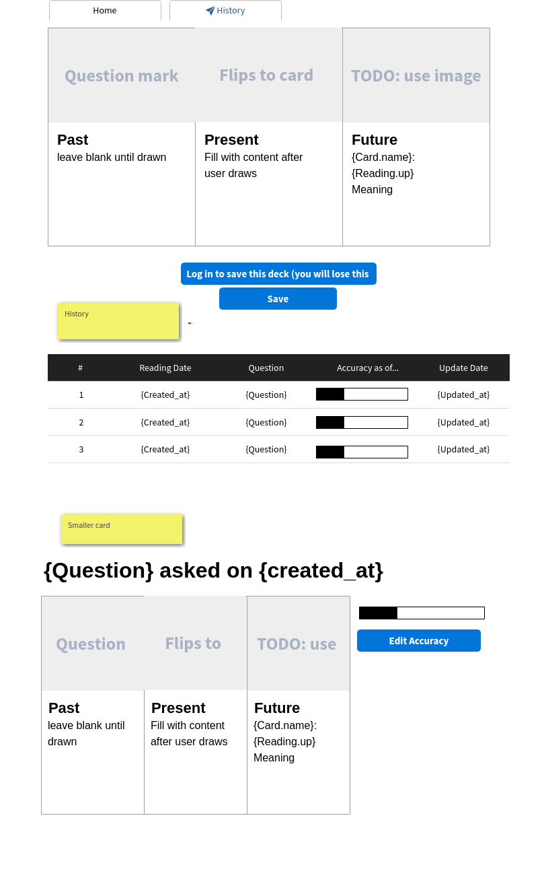
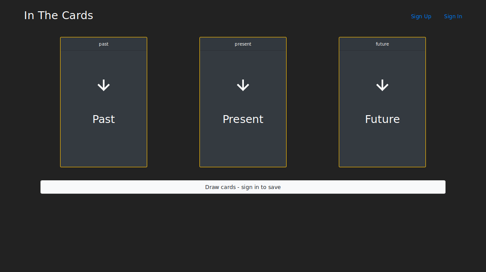

# react-auth-template

The front end for in-the-cards, a tarot reading app. See the back-end repository
[here](https://github.com/TaraYoo/in-the-cards). The back-end is deployed [here](https://pure-lowlands-31271.herokuapp.com/cards).

This app is deployed [here](https://tarayoo.github.io/in-the-cards-client/#/)

## Set up and Installation
1. Download this file.
1. Unzip and rename the template directory (unzip ~/Downloads/react-auth-template-master.zip).
1. Move into the new project and git init.
1. Replace in-the-cards-client in package.json with your projects name.
1. Replace the "homepage" field in package.json with your (public) Github account name and repository name.
1. Install dependencies with npm install.
1. git add and git commit your changes.
1. Run the development server with npm start.

Before deploying, you first need to make sure the `homepage` key in your
`package.json` is pointing to the correct value. It should be the url of your
deployed application.

To deploy you should first make sure you are on the `master` branch with a
clean working directory, then you can run `npm run deploy` and wait to see if
it runs successfully.

## Technologies used
1. axios
  - For API requests
2. bootstrap / react-bootstrap
  - For styling, and structure
4. dotenv
  - To import config variables from .env files
5. promise
  - To use promise chains
6. React
  - This front end is written in React.js
7. react-dom
8. react-router-dom
9. react-toastify
  - To use toasts for user alerts nad feedback

## Planning

#### Wireframe

This template is derived from GA Boston's [react-template](https://git.generalassemb.ly/ga-wdi-boston/react-template).
Most of the development dependencies, such as linters, SCSS compiler, Webpack
config, NPM scripts, etc in this repo come from there.

## Structure

The top-level `App` component stores the currently authenticated
user in state, as well as data related to the flash messages. `App` renders the
`Header` component, and a list of routes, each of which render a component from
`src/auth/components`. The `auth` directory has two non-component files, `api`
and `messages`, which contain all the needed `fetch` calls, and messages to
display when API calls succeed or fail, respectively.

The other components - `Deck`, `Cards`, etc. - follows the same pattern.

## Features and user stories

### History (as a user, I'd like to see my past readings)

History gets all past readings associated with a user, sorted by most recently
updated or created to least recent. Users can keep track of their readings'
accuracy, as well as delete unnecessary readings

### History/:id (as a user, I'd like to see details for a past reading)

When a user clicks on the details button in the History table, they'll see
the specific cards drawn for the particular deck. Users can delete the particular
reading, or update its accuracy

### History/:id/edit (as a user, I'd like to track how accurate my readings were)

Each deck details component has an edit button that opens a form for users to
edit a reading's accuracy. This app will also keep track of when the user last
updated an accuracy

### / (as a user, I'd like to do a three-card-spread reading)
Unauthorized users can still get a three card spread by clicking the draw button.
However, if they want to save a deck and keep track of its accuracy, they'd need
to sign in. After a user signs in, the deck gets saved whenever they click the
draw cards button. Users can also write down what questions they'd like to ask.

### /sign-up, /sign-in, /sign-out, /change-password
The above links are authorization features built by General Assembly Boston.

### Current app

### Future Goals
Create feature for users to upload their own card images to aws.

## Available Tasks

- `npm run nag`: runs code quality analysis tools on your code and complains.
- `npm run make-standard`: reformats all your code in the JavaScript Standard
  Style.
- `npm run start`: generates bundles, watches, and livereloads.
- `npm run build`: place bundled styles and scripts where `index.html` can find
    them
- `npm run deploy`: builds and deploys master branch

## Future Goals
- deck trying to save itself before actually saving. Probably a .. double click issue
- Show that there is no history yet if there is no history
